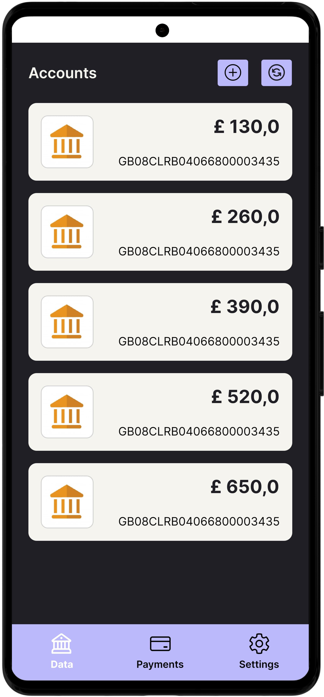
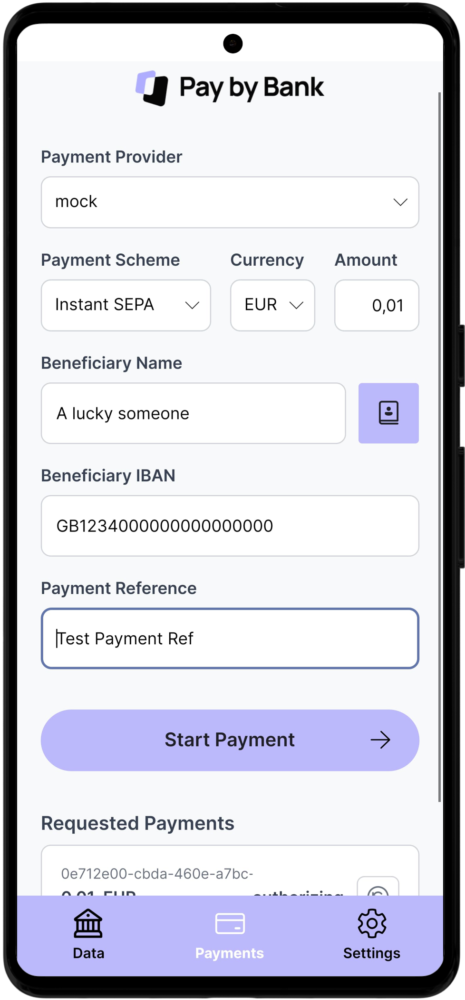

# TrueLayer Sample App

<p align="center">
  
  
</p>

This repository contains a sample cross-platform application built with [Avalonia UI](https://avaloniaui.net/).
It demonstrates how to use [TrueLayer's Open Banking APIs](https://docs.truelayer.com/reference/welcome-api-reference) on Android and Desktop platforms.
This project was created as a personal experiment to explore mobile development with AvaloniaUI and to better understand the world of payment integrations.

The app allows you to fetch user accounts, balances, and make simple SEPA payments using the providers (banks) available once you created an account on TrueLayer's console.
For newly created accounts, TrueLayer usually provides access to a mock bank account for testing purposes.

## Prerequisites

Before you begin, ensure you have the following installed:

- [.NET 9.0 SDK](https://dotnet.microsoft.com/download/dotnet/9.0) or later
- [JetBrains Rider](https://www.jetbrains.com/rider/) or [Visual Studio 2022](https://visualstudio.microsoft.com/downloads/) (recommended IDEs)
- For Android development:
  - [Android SDK](https://developer.android.com/studio) (API level 21 or higher)
  - [Java Development Kit (JDK)](https://www.oracle.com/java/technologies/downloads/) 8 or higher
- Git (for cloning and submodule management)

## Setup Guide

### 1. Clone the Repository

```bash
git clone https://github.com/antoniovalentini/truelayer-samples.git
cd truelayer-samples
git submodule update --init --recursive
```

### 2. Create TrueLayer Account

1. [Create an account on TrueLayer's console](https://docs.truelayer.com/docs/quickstart-create-a-console-account)
2. For Data APIs access, note down your `Client ID` and `Client Secret`
3. For Payments APIs, [generate a key pair](https://docs.truelayer.com/docs/quickstart-make-a-test-payment), upload the public key, and note down the `Key ID`
4. For data and payments authorizations, add the following URIs to the [console app Redirect URIs](https://docs.truelayer.com/docs/application-settings#redirect-uris)
    - `http://localhost:3000/callback` for the Desktop app
    - `mysecureapp://oauth2redirect` for the Android app

### 3. Configure Application Settings

Create or update the `appsettings.json` file in both platform projects:

- **For Desktop** (`src/MobileApp.Desktop/appsettings.json`)
- **For Android** (`src/MobileApp.Android/appsettings.json`)

```json
{
  "TrueLayer": {
    "ClientId": "your-client-id-here",
    "ClientSecret": "your-client-secret-here",
    "UseSandbox": true,
    "Payments": {
      "SigningKey": {
        "KeyId": "your-key-id-here"
      }
    }
  }
}
```

### 4. Add Private Key

Copy your generated private key file to both platform projects with the name `ec512-private-key.pem`:
- `src/MobileApp.Desktop/ec512-private-key.pem`
- `src/MobileApp.Android/ec512-private-key.pem`

## Security Notes ⚠️
This sample application is for demonstration purposes only. The security practices used here are not suitable for a production environment.
- **Private Key Management**: The private key is included directly in the project.
  In a production application, you must store private keys securely using a dedicated key management solution like Azure Key Vault, AWS KMS, or other hardware security modules.
- **Secret Storage**: Credentials and other sensitive data are stored in plain text on the device it is running on.
  This is insecure. Production apps should use secure storage mechanisms provided by the operating system (like Android's Keystore) or other encrypted storage solutions.

## Building and Running

### Desktop Application

```bash
# Navigate to the desktop project
cd src/MobileApp.Desktop

# Restore dependencies
dotnet restore

# Build the application
dotnet build

# Run the application
dotnet run
```

### Android Application

```bash
# Navigate to the Android project
cd src/MobileApp.Android

# Restore dependencies
dotnet restore

# Build for Android
dotnet build -f net9.0-android -p:AndroidSdkDirectory="<path-to-android-sdk>"

# Deploy to connected device/emulator
dotnet build -f net9.0-android -p:AndroidSdkDirectory="<path-to-android-sdk>" -t:Run
```

## Main Features

The app uses [TrueLayer's .NET SDK](https://github.com/TrueLayer/truelayer-dotnet) to access the following features:

- **Accounts**: List accounts and balances from the user's bank
- **Balances**: Get real-time balance information for each account
- **Payments**: Create SEPA payments and monitor their status
- **Payment Updates**: Request status updates for payment processing

**Note**: Accounts and Balances functionality uses a fork of the official TrueLayer .NET SDK (included as a submodule) until these features are available in the official SDK.

## Implementation Details

The app uses Avalonia UI to provide a cross-platform user interface with the following features:
- **Navigation**: The app provides a simple navigation system to switch between different views (Accounts, Payments, Settings) using a bottom navigation bar that assigns a specific viewmodel to a `TransitioningContentControl`. The `ViewLocator` will then resolve the view for the viewmodel.
- **Data Binding**: data binding is used to connect the UI with the underlying data models, updating the UI through property changes events.
- **Dependency Injection**: The app uses dependency injection to manage dependencies and view models.
- **Logging**: The app uses the standard Microsoft's `ILogger` interface to log messages directly to the console.
- **Storage**: Data is stored in plain text files in the user's local storage directory.
- **HTTP callbacks**: The app has platform-specific implementations for handling HTTP callbacks: an HTTP server for Desktop and Deep Links for Android.

## Disclaimer

This is a sample application and is not intended for production use.
It is provided as-is, without any warranties or guarantees.
Please refer to TrueLayer's documentation for production-ready implementations and security best practices.

This project is a personal initiative created for educational and experimental purposes. It is not affiliated with, authorized by, endorsed by, or in any way officially connected with TrueLayer Ltd. All product and company names are the registered trademarks of their original owners. The use of the TrueLayer name, branding, and APIs is for identification and demonstration purposes only and does not imply any association with the trademark holder.

## License

This project is licensed under the MIT License. See the [LICENSE](./LICENSE) file for details.
